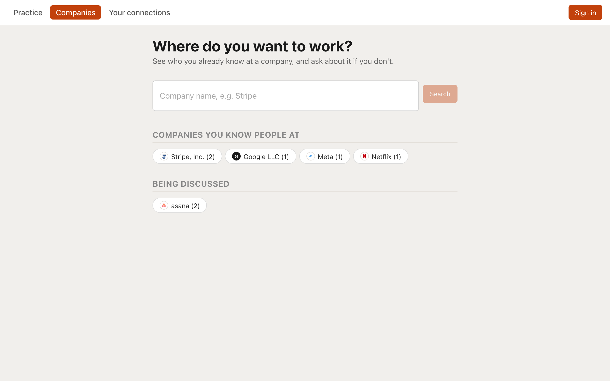
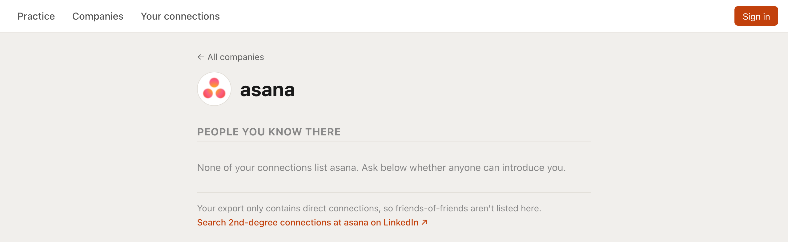
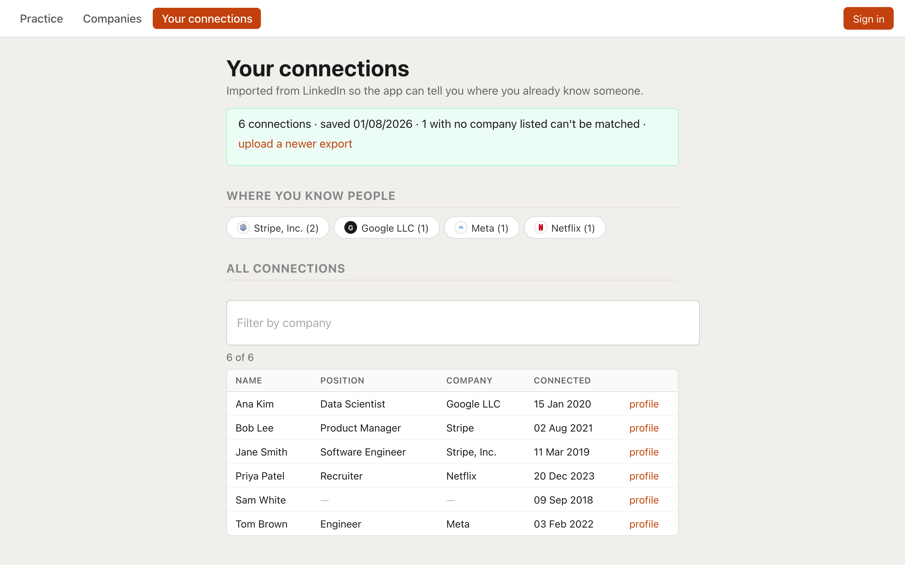
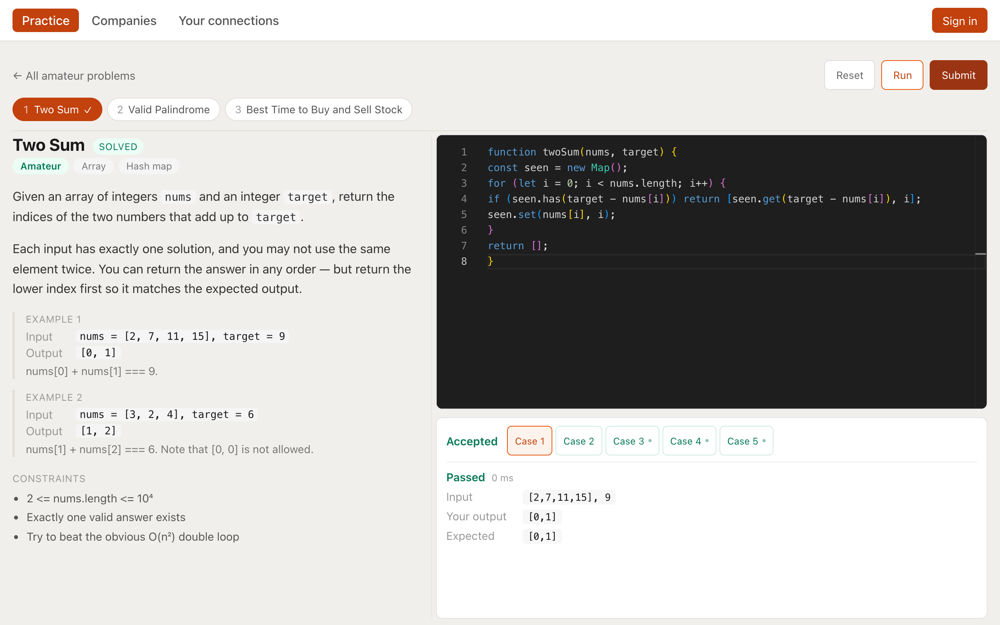

# Where do you want to work?

A job-search networking tool organised around **the company you want to work at**, not around a feed. Name a company, see which of your LinkedIn connections already work there, and if you know nobody — ask whether anyone can introduce you.



## The core loop

1. **Name a company.**
2. **See who you know there** — imported once from your own LinkedIn export, matched against every spelling of that company's name.
3. **If you know nobody, ask** — post about the company, and read what others have asked.
4. Practice for the interview you're trying to get, separately, whenever you want.



## Screenshots

| Your connections | Practice |
|---|---|
|  |  |

## Quick start

```
npm install
npm run dev
```

This starts all eight processes — six `blog/` microservices, `auth`, and `referrals` — with labeled, color-coded output, and a single Ctrl+C stops all of them. Each subproject still needs its own dependencies installed once first (see [`CLAUDE.md`](./CLAUDE.md) for per-service setup, including `blog/query`'s Python venv and `blog/client`'s `.env` for Google sign-in). `npm run stop` frees every port the stack uses if a crashed run leaves one held.

`docker-compose up` is the alternative: builds every service from its own `Dockerfile`, no local Node/Python/venv required.

## Services

| Service | Stack | Port | Role |
|---|---|---|---|
| [`blog/client`](./blog/client) | React (CRA) | 3001 | The one UI for everything below — companies, connections, practice |
| [`blog/posts`](./blog/posts) | Express (Node) | 3000 | Owns posts (`{ id, title, company, type }`); publishes `PostCreated` |
| [`blog/comments`](./blog/comments) | Express (Node) | 4000 | Owns comment content only; publishes `CommentCreated`. Doesn't know about moderation. |
| [`blog/event-bus`](./blog/event-bus) | Express (Node) | 4005 | Receives every event and routes it, by type, only to the subscribers that consume it |
| [`blog/moderation`](./blog/moderation) | Express (Node) | 4003 | Checks new comments against a banned-term list; publishes `CommentModerated` with the matched terms |
| [`blog/query`](./blog/query) | FastAPI (Python) | 4002 | Builds the combined read-model (posts + embedded comments + moderation state) from events |
| [`auth`](./auth) | Express (Node) | 4007 | Owns identity — Google or email/password sign-in — and issues the session tokens `posts`/`comments` verify against |
| [`referrals`](./referrals) | Express (Node) | 4006 | Parses a LinkedIn `Connections.csv` export and answers "who do I know at X" |

`posts`, `comments`, and `moderation` never call each other directly — they only own their own data and publish/consume events through `event-bus`; `query` is the only service that returns posts with comments embedded and the only one tracking moderation state. `referrals` shares no data with any of the above and isn't on the event bus — the client is what joins "people you know" and "what's being asked" into one company page.

See [`CLAUDE.md`](./CLAUDE.md) for the full per-service breakdown, the authentication design, and the eventual-consistency tradeoffs this event-driven pattern implies.


*(the diagram above predates `auth`, `referrals`, and the practice feature — it covers the original `blog/` event flow only)*
