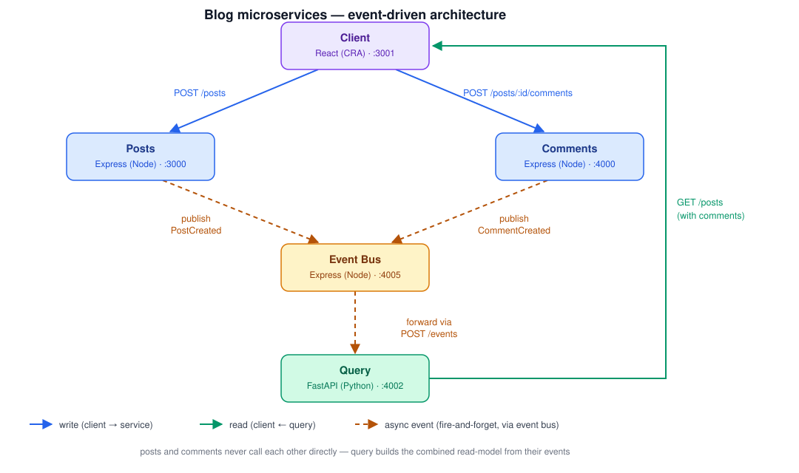

# Blog microservices

A small event-driven microservices exercise: six independent services that talk to each other over HTTP.

## Services

| Service | Stack | Port | Role |
|---|---|---|---|
| [`posts`](./blog/posts) | Express (Node) | 3000 | Owns posts (`{ id, title }`); publishes `PostCreated` |
| [`comments`](./blog/comments) | Express (Node) | 4000 | Owns comment content only; publishes `CommentCreated`. Doesn't know about moderation. |
| [`event-bus`](./blog/event-bus) | Express (Node) | 4005 | Receives every event and routes it, by type, only to the subscribers that consume it |
| [`moderation`](./blog/moderation) | Express (Node) | 4003 | Checks new comments for banned words; publishes `CommentModerated` (`approved`/`rejected`) |
| [`query`](./blog/query) | FastAPI (Python) | 4002 | Builds the combined read-model (posts + embedded comments + moderation status) from events |
| [`client`](./blog/client) | React (CRA) | 3001 | Writes to `posts`/`comments`, reads from `query` |

`posts`, `comments`, and `moderation` never call each other directly — they only own their own data and publish/consume events through `event-bus`. `query` is the only service that returns posts with comments embedded, and the only one that tracks moderation status — it defaults new comments to `pending` and flips them to `approved`/`rejected` once `moderation`'s verdict propagates back. `comments` itself never learns the verdict; it only ever stores raw content.

See [`CLAUDE.md`](./CLAUDE.md) for setup/run commands per service and more detail on the eventual-consistency tradeoffs this pattern implies.
